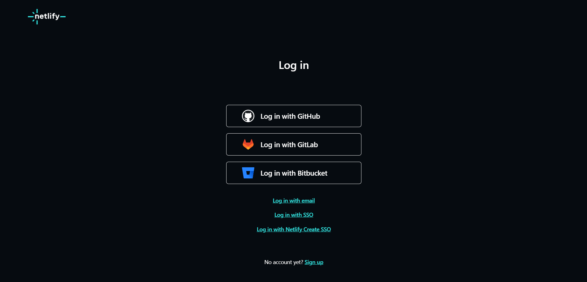
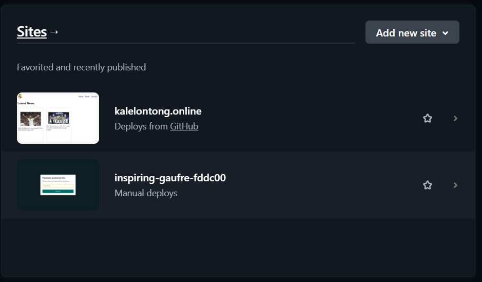
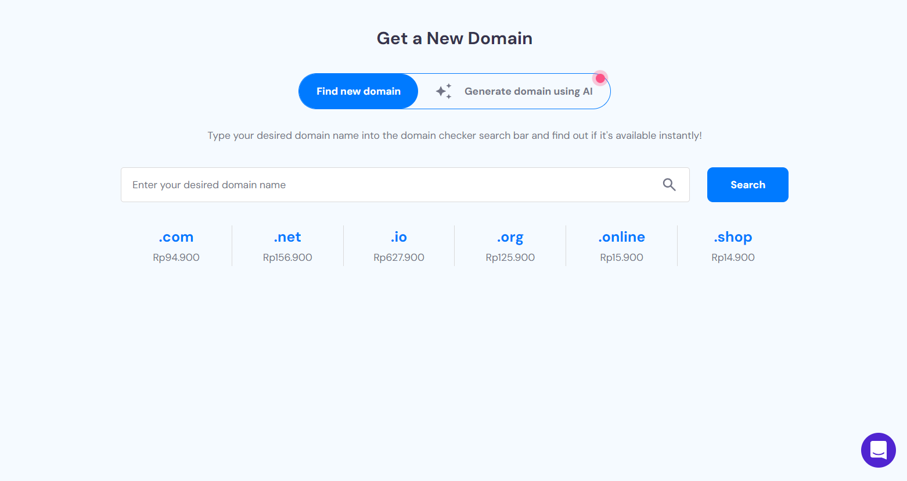
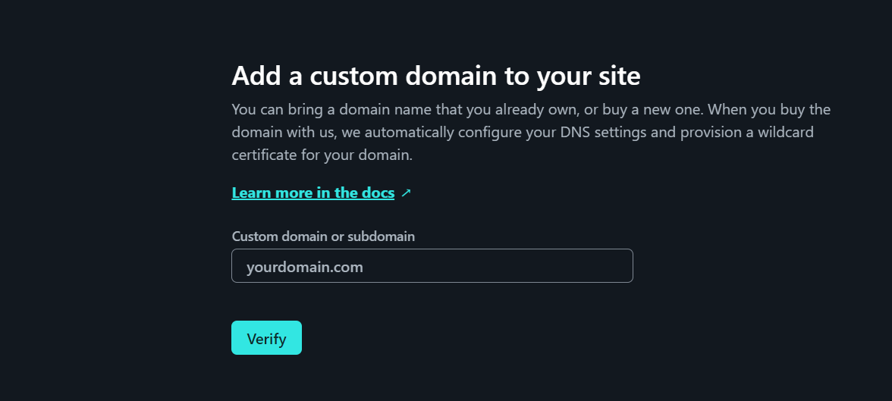
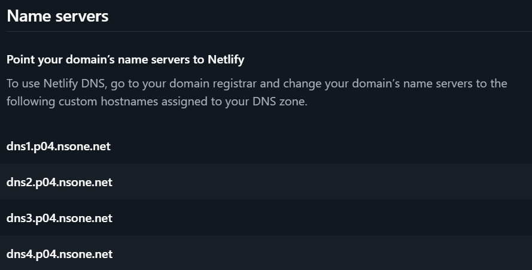
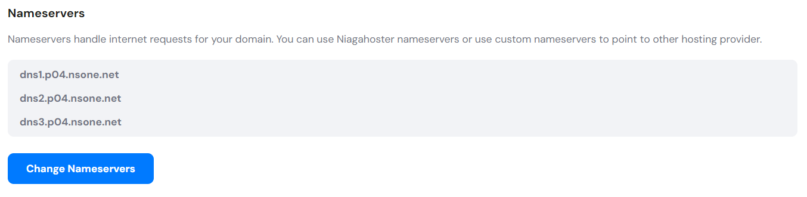

# Real Madrid Galleries

Welcome to the captivating online realm of the Real Madrid Football Club Gallery, where the rich history and thrilling moments of one of the world's most iconic football clubs come to life through a virtual tapestry of images and memories.

Immerse yourself in the stunning visual journey that spans the decades, showcasing the triumphs, glories, and unforgettable moments that have defined Real Madrid's legacy. Our meticulously curated gallery captures the essence of the club's illustrious past, from its humble beginnings to becoming a global football powerhouse.

Explore the trophy-laden halls featuring images of legendary players, iconic managers, and the electrifying celebrations that have echoed through the Santiago Bernabéu Stadium. Marvel at the golden moments of victory, the heart-stopping goals, and the indomitable spirit that has made Real Madrid a symbol of excellence in the world of football.

Dive into themed collections that highlight pivotal eras, historic matches, and the evolution of the club's iconic kit. Each photograph tells a story, and each story contributes to the rich tapestry of Real Madrid's journey, making the gallery a treasure trove for fans and football enthusiasts alike.

The interactive nature of our web gallery allows fans to not only view but also engage with the content. From virtual tours of the stadium to multimedia presentations on the club's milestones, this online experience is designed to connect fans from around the globe to the heart and soul of Real Madrid.

Whether you're a devoted supporter reliving cherished memories or a newcomer eager to discover the magic of Real Madrid, our web gallery offers an immersive and visually stunning exploration of the club's heritage. Welcome to a digital space where the passion, glory, and legacy of Real Madrid Football Club are celebrated in every pixel.

# Documentation

First you have to sign up for a netlify account and then connect it to the github that you have.

after that connect netlify with the code that has been pushed into the git repository. the code that has been connected to netilfy will appear on the netlify page.

the next step is to create a domain on niagahoster. previously, you will be asked to sign up for a niagahoster account and will be asked to fill in the domain name you want to use.

After choosing the domain name you want to use, the price offer of the domain you choose will be displayed. the price displayed is influenced by the duration of how long you want the domain to have.

then you will go back to netlify and set up the domain and enter the domain name that was purchased earlier.

after that you will visit niagahoster again to enter the DNS from netlify into niagahoster.

then wait until your web is connected to the new domain.

Congratulations, you have successfully created a new domain with the name you want.

[Real Madrid News](www.kalelontong.online)
